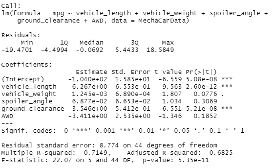
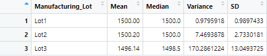
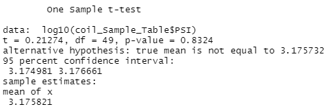
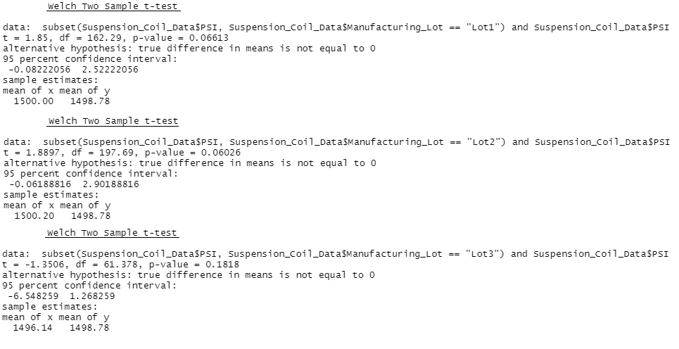

# MechaCar Statistical Analysis Challenge

## Linear Regression to Predict MPG

- The variables that provided a non-random amount of variance to mpg in this dataset are the vehicle length and ground clearance. The intercept also provides a non-random amount of variance.

- The slope of the linear model is not zero. We know because the p-value is 5.53e-11, which is smaller than the significance level of 0.05.

- The linear model predicts the mpg of the prototypes relatively effectively. The R-squared is 0.71. Meaning, the variability of the dependent variable is 71%, so it is pretty good, but not great.

## Summary Statistics on Suspension Coils
<b>All Lots Summary</b>

<b>Individual Lots Summary</b>

- With the design specifications, the variance of the suspension coils cannot exceed 100 pounds per square inch. The manufacturing data overall meets this requirement, with a variance of 62.3. However, only 2 of the 3 lots meet the requirement. Lot 1 and Lot  2 have a variance under 100, with 0.98 and 7.5 respectively. Lot 3, however, has a variance of 170, putting it way over the limit.

## T-Tests on Suspension Coils

- Testing a sample of 50 from the lots altogether against the population mean of 1,500 pounds, the p-value was given as 0.8324. This number is larger than the significance level of 0.05, so the null hypothesis cannot be rejected. The means are statistically similar.

- Looking at the lots individually against the population mean, on the other hand, Lot 1 had a p-value of 0.06613, Lot 2 had a p-value of 0.06026, and Lot 3 had a p-value of 0.1818. All three of these are larger than the significance value of 0.05, so in each case the null hypothesis cannot be rejected. The means are statistically similar with the population mean cross the three lots. However, it should be noted that Lot 3 is much farther from the significance valued compared to Lot 1 and Lot 2.

## Study Design: MechaCar vs Competition

One of the first things that should be considered when looking at how to compete and surpass competition is sales. So, that is what I suggest we look at here. I suggest starting by looking at the sales in urban, suburban, and rural cities for both us and a competitor. If we know how we perform and how they perform, it can inform us of strengths and weaknesses, and we can develop plans to accommodate both before looking at other factors that can bolster sales.

- The metric we'll look at is sales across city types (urban, suburban, and rural) within a singular or a few states.

- Our alternative hypothesis will be: The farther an urban city or rural city is from a suburban city is, the lower its sales will be.

- In this case we'd use a one-way ANOVA test, because our independent variable (cities) has multiple groups (city types) that will be used to test the dependent variable (sales).

- To run this statistical test we need data of our sales across the desired cities, and we would need data from the same cities from whatever competitors we wish to compare against. So, the cities we look look may be dependent on what data we can get our hands on from our competitors, but it is a good place to start.
